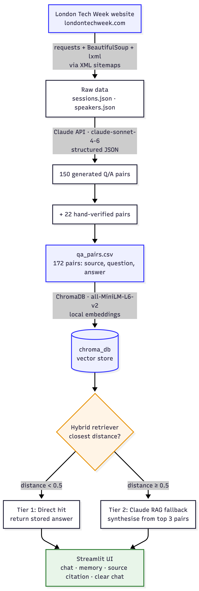
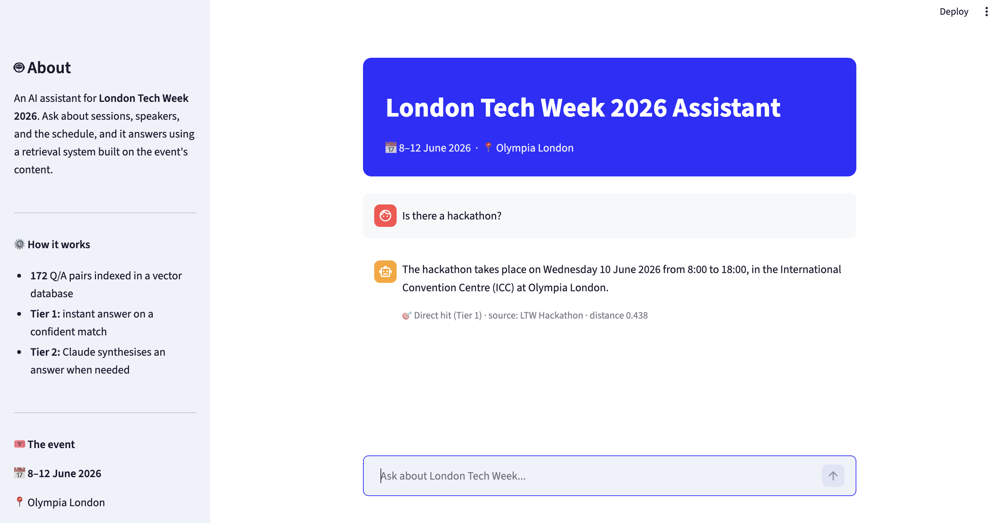
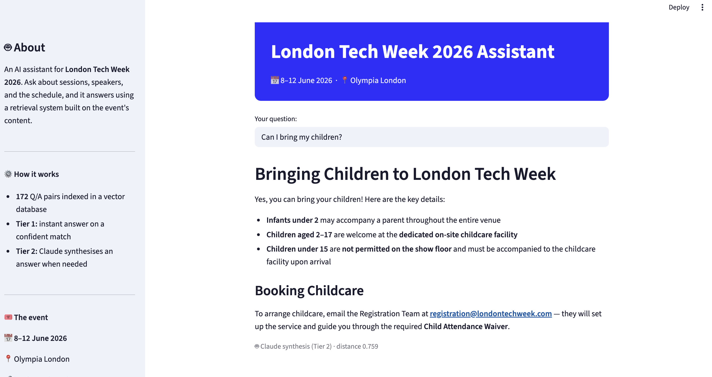

# RAG Chatbot for London Tech Week 2026

A Retrieval-Augmented Generation (RAG) chatbot that answers questions about **London Tech Week 2026** — speakers, sessions, the agenda, and practical event information.

Built as the project for the Codecademy *Building Agentic AI Applications for Beginners* bootcamp (AGAI-03).

---

## What it does

Ask the assistant a question about London Tech Week 2026 (8–12 June 2026, Olympia London) and it answers using a hybrid retrieval system built on the event's own content — 172 question-and-answer pairs stored in a vector database.

It uses a **two-tier hybrid retrieval** approach:

- **Tier 1 — Direct hit:** if the question closely matches a stored question, the stored answer is returned instantly (no LLM call needed).
- **Tier 2 — Claude synthesis:** if there's no confident match, the top related pairs are passed to Claude, which synthesises a grounded answer from them.

Each answer shows its **source** and a **confidence (distance) score**, so you can see where it came from.

---

## Architecture



The pipeline: scrape the site via its XML sitemaps → save raw data → generate Q/A pairs with Claude (plus hand-verified additions) → embed and store in ChromaDB → serve through a hybrid retriever and a Streamlit chat interface.

---

## Screenshots

**Tier 1 — a direct hit.** The answer comes straight from a stored Q/A pair, with its source and distance shown.



**Tier 2 — Claude synthesis.** For a question with no single exact match, Claude combines several retrieved pairs into one organised answer.



**The interface.** A branded sidebar with project info, live statistics, and a Clear chat button.


---

## Tech stack

- **Python 3.12**
- **Scraping:** requests, beautifulsoup4, lxml
- **LLM (Q/A generation and Tier 2 answers):** Anthropic Claude API (`claude-sonnet-4-6`)
- **Vector database:** ChromaDB, using its default local embedding model (sentence-transformers `all-MiniLM-L6-v2`)
- **User interface:** Streamlit
- **Other:** pandas, python-dotenv

---

## Project structure

```
rag-chatbot-ltw/
├── data/
│   ├── raw/                # scraped pages (sessions.json, speakers.json)
│   └── processed/
│       └── qa_pairs.csv    # 172 Q/A pairs (source, question, answer)
├── src/
│   ├── scraper.py          # scrapes the site via XML sitemaps
│   ├── qa_generator.py     # generates Q/A pairs with Claude
│   ├── vector_store.py     # builds the ChromaDB vector store
│   ├── retriever.py        # hybrid two-tier retrieval logic
│   └── app.py              # Streamlit chat interface
├── images/                 # diagram and screenshots
├── requirements.txt
├── README.md
└── report.pdf              # full project report
```

---

## How to run locally

1. **Clone the repository**

   ```
   git clone https://github.com/Csandal17/rag-chatbot-ltw.git
   cd rag-chatbot-ltw
   ```

2. **Create and activate a virtual environment**

   ```
   python3 -m venv venv
   source venv/bin/activate        # macOS / Linux
   ```

3. **Install dependencies**

   ```
   pip install -r requirements.txt
   ```

4. **Add your Anthropic API key**

   Create a file called `.env` in the project root with:

   ```
   ANTHROPIC_API_KEY=your-key-here
   ```

5. **Build the vector store** (creates the `chroma_db/` folder from the Q/A data)

   ```
   python src/vector_store.py
   ```

6. **Run the app**

   ```
   streamlit run src/app.py
   ```

   The app opens in your browser at `http://localhost:8501`.

---

## Features

- Two-tier hybrid retrieval (direct hit + LLM synthesis)
- Chat interface with conversation memory
- Source citation and confidence score under every answer
- Clear chat button
- Informative sidebar with project info and live statistics
- London Tech Week branded theme

---

## Notes

- The `chroma_db/` folder is not committed — it is regenerated from `qa_pairs.csv` by running `src/vector_store.py`.
- The `.env` file (containing the API key) is excluded from version control.
- A full write-up of the design, methodology, challenges, and future improvements is in **report.pdf**.

---

*Author: Chantal Sandal · May 2026*